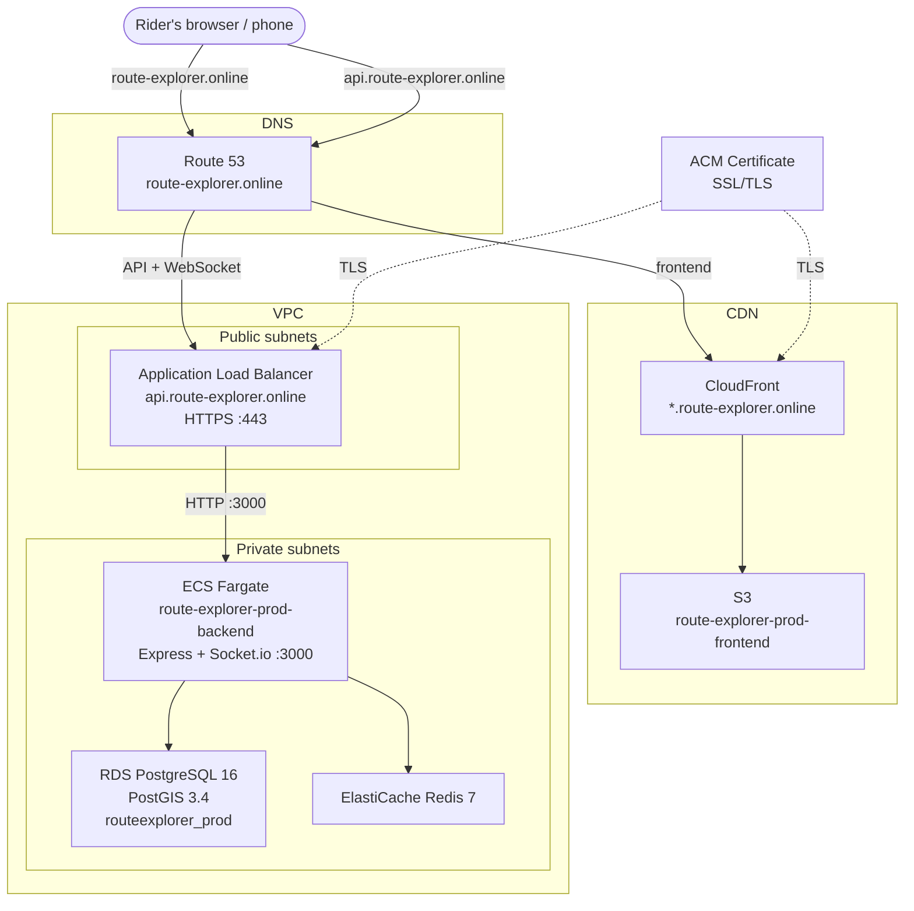

# Architecture

## Components

**React PWA**: The frontend, built with Vite. Runs entirely in the browser with no install required. Communicates with the backend over HTTPS for REST calls and WebSocket for real-time GPS streaming.

**CloudFront + S3**: The frontend is deployed as static files to S3 and served globally via CloudFront. CloudFront handles HTTPS termination and caching for all static assets. The browser hits CloudFront directly, S3 is only accessed by CloudFront on a cache miss. 

**Application Load Balancer**: Receives all traffic from the frontend. Routes HTTP and WebSocket connections to ECS. Used instead of API Gateway because API Gateway HTTP APIs do not support WebSocket upgrades.

**ECS Fargate**: Runs the Express + Socket.io backend as a containerized service. Stateless, No EC2 instances to manage

**RDS in private subnet**: Stores users, rides, GPS route points, and the road graph. PostGIS handles all spatial queries like distance calculation, line construction, and geographic point storage. The database is not publicly accesible. Only the ECS task can reach it from within the same VPC

**ElastiCache Redis in private subnet**: Caches the road graph adjacency list loaded from PostgreSQL. The graph is ~18,000 nodes and expensive to rebuild from SQL on every request. Redis keeps it in memory and shares it across all ECS instances. Same isolation as RDS