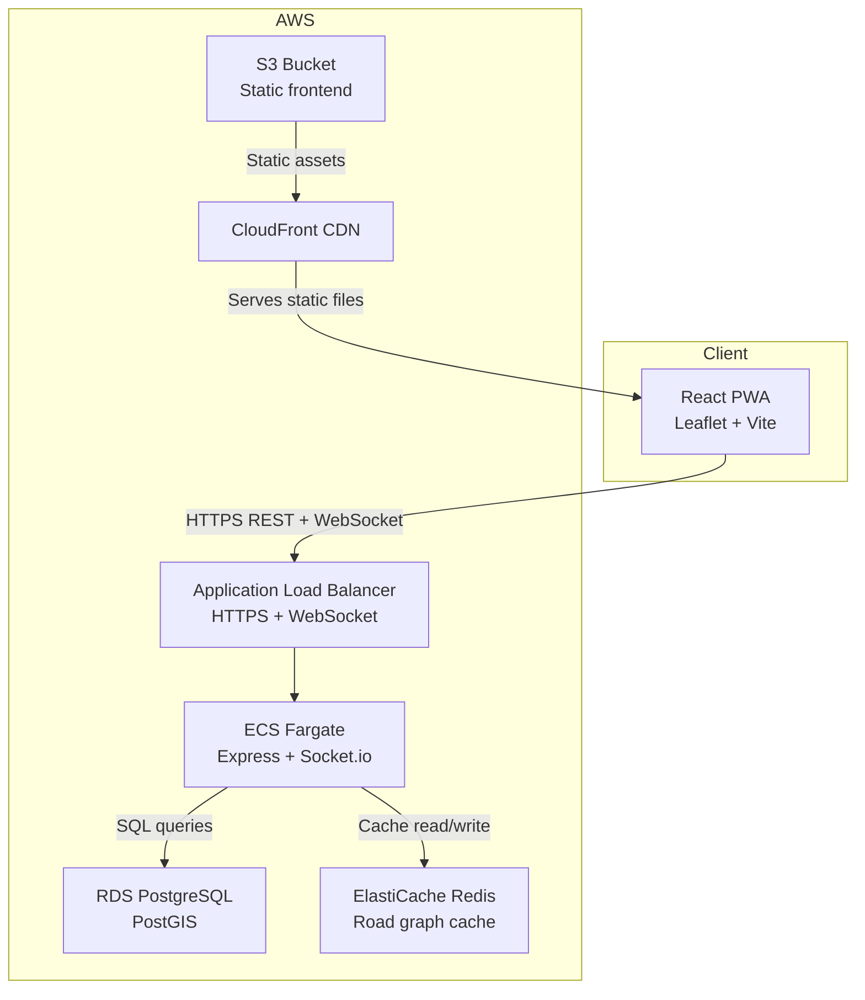

# High-Level Architecture

## Components

**React PWA**: the frontend, built with Vite. Runs entirely in the browser with no install required. Communicates with the backend over HTTPS for REST calls and WebSocket for real-time GPS streaming.

**CloudFront + S3**: the frontend is deployed as static files to S3 and served globally via CloudFront. CloudFront handles HTTPS termination and caching for all static assets.

**Application Load Balancer**: receives all traffic from the frontend. Routes HTTP and WebSocket connections to ECS. Used instead of API Gateway because API Gateway HTTP APIs do not support WebSocket upgrades.

**ECS Fargate**: runs the Express + Socket.io backend as a containerized service. Stateless — any number of instances can run behind the ALB.

**RDS PostgreSQL + PostGIS**: stores users, rides, GPS route points, and the road graph. PostGIS handles all spatial queries — distance calculation, line construction, and geographic point storage.

**ElastiCache Redis**: caches the road graph adjacency list loaded from PostgreSQL. The graph is ~18,000 nodes and expensive to rebuild from SQL on every request. Redis keeps it in memory and shares it across all ECS instances.