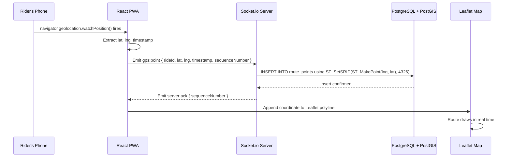

# Real-Time GPS Tracking Data Flow

How a GPS coordinate travels from the rider's phone to the database and back to the map.

## Steps explained

1. **watchPosition fires** — the browser's Geolocation API fires a callback every 3–5 seconds while the ride is active, providing the current latitude, longitude, and timestamp
2. **Emit gps:point** — the frontend sends the coordinate to the backend over a persistent WebSocket connection managed by Socket.io
3. **PostGIS insert** — the backend inserts the point into the `route_points` table using `ST_SetSRID(ST_MakePoint(lng, lat), 4326)::geography` which stores it as a native geographic type
4. **server:ack** — the backend acknowledges the insert so the frontend knows the point was saved successfully
5. **Polyline update** — the frontend appends the new coordinate to the Leaflet polyline, extending the route drawn on the map in real time