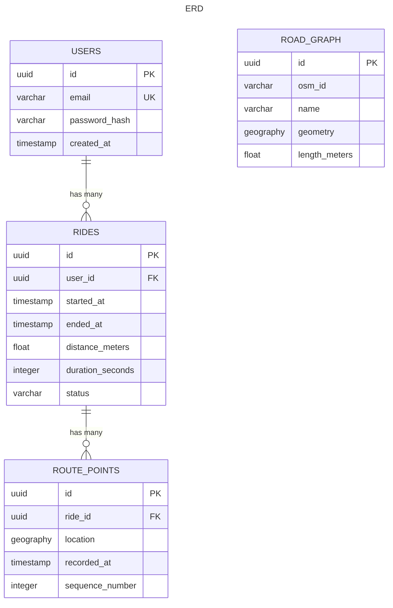

```mermaid
---
title: ERD
---
erDiagram
USERS {
uuid id PK
varchar email UK
varchar password_hash
timestamp created_at
}
RIDES {
uuid id PK
uuid user_id FK
timestamp started_at
timestamp ended_at
float distance_meters
integer duration_seconds
varchar status
}

ROUTE_POINTS{
uuid id PK
uuid ride_id FK
geography location
timestamp recorded_at
integer sequence_number
}

ROAD_GRAPH{
uuid id PK
varchar osm_id
varchar name
geography geometry
float length_meters
}
    USERS ||--o{ RIDES : "has many"
    RIDES ||--o{ ROUTE_POINTS : "has many"
    ROAD_GRAPH
```